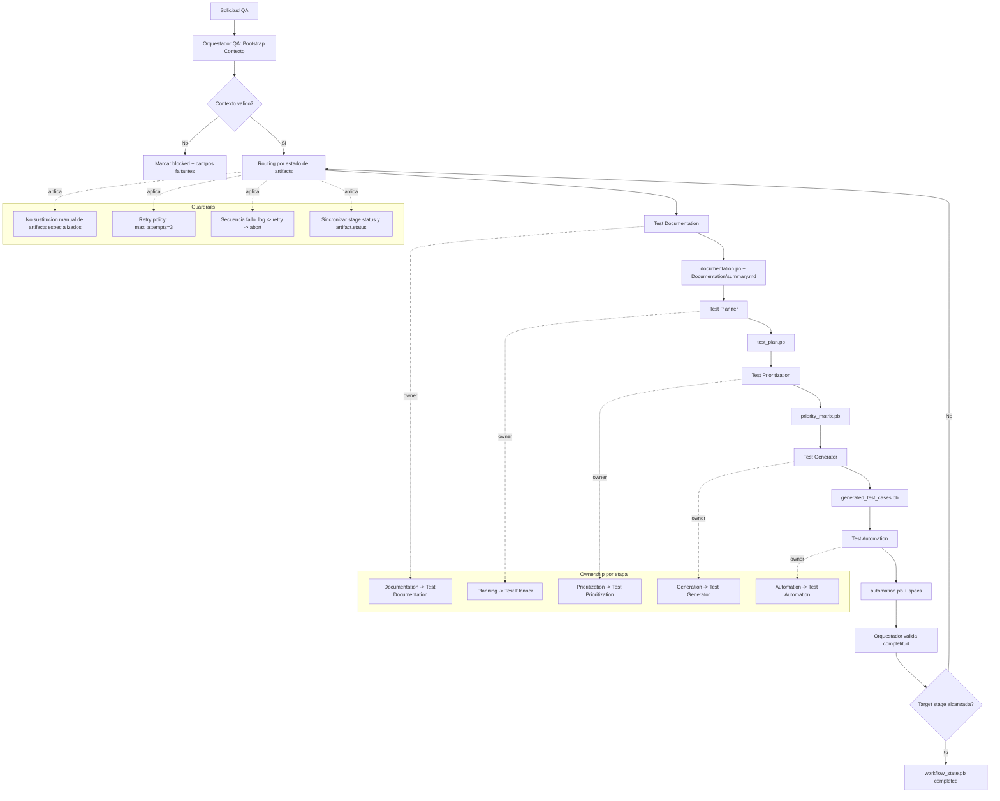

# Flujo De Trabajo QA Multiagente

Este diagrama muestra el flujo canonical y las reglas de control del Orquestador QA.

## Secuencia resumida

1. El Orquestador recibe solicitud_qa y normaliza contexto.
2. Ejecuta routing secuencial por artifacts faltantes o incompletos.
3. Cada etapa produce su artifact protobuf y actualiza estado.
4. Ante fallo: log, reintento hasta 3 intentos, luego abort.
5. Se finaliza al completar target_stage o Automation por default.

## Skills minimas por agente

- Orquestador QA: bootstrap, validacion routing, sincronizacion, replanificacion, retries, guardrails.
- Test Documentation: extraccion, normalizacion, trazabilidad, huecos, dependencias.
- Test Planner: cobertura, suites, trazabilidad estructural, precondiciones.
- Test Prioritization: riesgo, buckets, automatizacion, rationale auditable.
- Test Generator: expansion detallada, datos de prueba, claridad operativa.
- Test Automation: implementacion Playwright, reutilizacion POM, trazabilidad tecnica.
